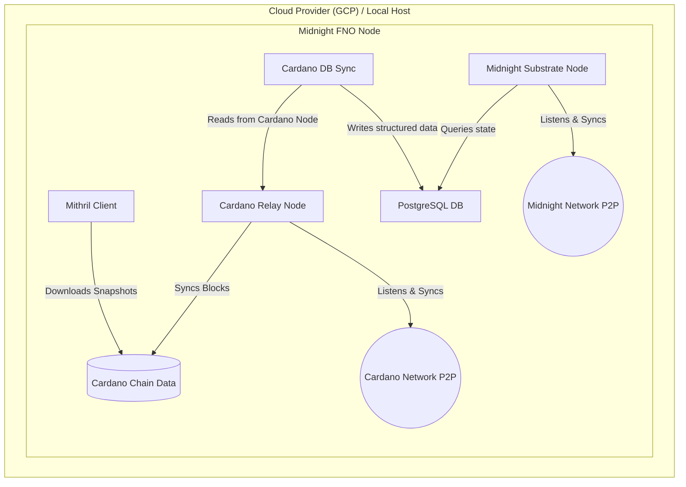

# 🌑 Midnight Network: Infrastructure Automation

[]()
[]()
[]()

## 📑 Executive Summary

This repository encapsulates the deployment scripts, operational runbooks, observability stack, and Day-2 automation tooling required to securely operate a **Full Node Operator (FNO)** on the Midnight Networks (Preview, Pre-Production, and Mainnet). 

Designed with production-grade engineering principles, this setup explicitly handles Midnight's architecture as a Cardano Partner Chain. It systematically orchestrates the critical dependencies—Mithril snapshotting, Cardano Relay sync, and PostgreSQL database initialization via `cardano-db-sync`—before bootstrapping the Midnight Substrate runtime.

---

## 🏗 Architecture & Design Philosophy

1. **Dependency Sequencing:** The Midnight node possesses a hard dependency on a synchronized Cardano state. The automation explicitly manages this initialization phase to prevent premature Substrate startup failures.
2. **Data Availability (Archive Mode):** To support local indexers, block explorers, and rigorous testnet transaction tracking, the node defaults to `--pruning archive`. RPC WebSocket endpoints are explicitly exposed with strict CORS boundaries.
3. **Cloud-Native & Idempotent:** Shell scripts are engineered to be `cloud-init` compliant, allowing for zero-touch infrastructure provisioning on cloud providers like Google Cloud Platform (GCP).

### System Architecture



---

## 📂 Repository Structure

```text
.
├── README.md                           # Documentation entrypoint (this file)
├── RUNBOOK.md                          # Step-by-step manual FNO onboarding & recovery procedures
├── SECURITY.md                         # Threat modeling, key management & incident response protocols
├── monitoring/
│   ├── configs/
│   │   ├── docker-compose.yml          # Containerized telemetry stack (Prometheus + Grafana)
│   │   └── prometheus.yml              # Target configurations for Substrate metric scraping
│   └── alerts/
│       └── node_alerts.yml             # Critical alerting thresholds (Block stalling, CPU, Peers)
└── scripts/
    ├── ansible/                        # Infrastructure as Code (Ansible Playbooks)
    │   ├── inventory/
    │   │   └── hosts.ini
    │   ├── setup_node.yml              # Main playbook
    │   └── roles/
    │       ├── common/                 # Base dependencies and user management
    │       ├── postgres/               # PostgreSQL 17 configuration & tuning
    │       ├── cardano_node/           # Mithril snapshot and Cardano relay config
    │       ├── cardano_db_sync/        # Cardano DB Sync daemon integration
    │       └── midnight_node/          # Substrate node and archive mode setup
    ├── terraform/                      # Infrastructure as Code (Terraform)
    │   ├── main.tf                     # Provider and backend configuration
    │   ├── variables.tf                # Input variables
    │   ├── network.tf                  # VPC, subnets, and firewall rules
    │   ├── iam.tf                      # Service accounts and IAM roles
    │   ├── compute.tf                  # Compute instance configuration
    │   └── outputs.tf                  # Outputs (IPs, SSH commands)
    ├── gcp_deploy.sh                   # (DEPRECATED) GCP VM provisioning automation
    ├── install_midnight_archive_node.sh # Cloud-Init target: Zero-touch node setup
    ├── health_check.sh                 # Day-2: RPC-based health & regression monitoring (Option C)
    ├── key_collection.sh               # Day-2: Idempotent FNO public key collector (Option A)
    └── maintenance_notify.sh           # Day-2: Automated maintenance notification & ACK tracking (Option B)
```

---

## ✅ Prerequisites

Depending on your chosen deployment method, ensure you have the following tools installed:

- **Google Cloud CLI (`gcloud`)**: Required for authenticating and deploying to GCP.
- **Terraform (`>= 1.5.0`)**: Required for the Infrastructure as Code (GCP) deployment.
- **Ansible (`>= 2.14`)**: Required for configuration management and bare-metal/on-prem deployments.
- **Git**: For cloning and interacting with the repository.

---

## 🚀 Deployment Operations

### Option 1: Infrastructure as Code (Terraform on GCP)
For frictionless, reproducible infrastructure, Terraform is used to provision the network, IAM roles, firewall rules, and an `e2-standard-4` (Ubuntu 22.04, 500GB SSD) compute instance on Google Cloud. 

```bash
# Authenticate with Google Cloud
gcloud auth application-default login

# Initialize and apply the Terraform configuration
cd scripts/terraform
terraform init
terraform apply -var="project_id=[YOUR_PROJECT_ID]" -var="target_network=preprod"
```
*The VM will boot and immediately execute `install_midnight_archive_node.sh` via cloud-init, safely configuring the `midnight` user environment and pulling the Mithril snapshots.*

### Option 2: Configuration Management (Ansible)
For on-premise environments, bare-metal clusters, or existing VMs, the entire node setup has been codified into modular Ansible playbooks. This ensures fine-grained idempotency.

```bash
# Run the setup playbook locally (or against remote hosts via inventory)
# Provide the target network via extra-vars: 'preview', 'preprod', or 'mainnet'
ansible-playbook -i scripts/ansible/inventory/hosts.ini scripts/ansible/setup_node.yml --extra-vars "network=preprod"
```
*The playbook cleanly separates roles (`common`, `postgres`, `cardano_node`, `midnight_node`) so you can run, test, or re-run specific components without state drift.*

### Option 3: Manual / On-Premise Setup
For a step-by-step educational guide on bootstrapping the Cardano dependencies and the Midnight node manually, refer to **[`RUNBOOK.md`](./RUNBOOK.md)**.

---

## 📊 Observability (Telemetry)

Robust visibility into the node's state is non-negotiable for an FNO. The `monitoring/` directory contains a lightweight, containerized telemetry stack.

### Alerting Rationale (`node_alerts.yml`)
Alerts are designed with a high signal-to-noise ratio to prevent alert fatigue:
1. **`BlockProductionStalled` (Critical):** Triggers if `substrate_block_height` remains static for 5 minutes. *Action: Investigate DB Sync connection or restart node service.*
2. **`LowPeerCount` (Warning):** Triggers if `libp2p_peers_count` falls below 5. Substrate consensus degrades rapidly without adequate peer propagation. *Action: Validate port 30333 reachability and bootnode health.*
3. **`HighCpuUsage` (Warning):** Triggers if CPU sustains >85% for 10 minutes. *Action: Check for RPC spam or prepare to vertically scale compute.*

---

## 🤝 Contributing

We welcome contributions from the open-source community! Whether it's adding support for AWS/Azure, improving monitoring dashboards, or fixing typos.

Please see our [CONTRIBUTING.md](CONTRIBUTING.md) for detailed guidelines on how to submit pull requests, run the linters, and utilize the included `Makefile`. We enforce a strict [Code of Conduct](CODE_OF_CONDUCT.md).

---

## 🛠 Day-2 Automation Tools

Operational scripts (located in `scripts/`) are built with idempotency and structured output (JSON) in mind, allowing them to be seamlessly integrated into CI/CD pipelines or cron jobs.

*   **`health_check.sh`**: Polls the local `system_health` RPC endpoint, evaluates peer counts/sync status, and diffs the output against previous runs to detect silent regressions.
*   **`key_collection.sh`**: Iterates through a mock directory of FNOs to request public keys, saving state efficiently so subsequent runs only target non-responsive operators.
*   **`maintenance_notify.sh`**: Simulates sending structured maintenance window alerts, tracks asynchronous acknowledgments, and flags operators who exceed the SLA timeout.

---

## 🔒 Security Posture

Operational security, specifically regarding the generation, storage, and rotation of Validator Session Keys, is detailed in **[`SECURITY.md`](./SECURITY.md)**. 
It covers cloud-native storage (KMS/Secrets Manager), HSM integration tradeoffs, and a strict 3-step Incident Response protocol for compromised credentials.

---

## 📌 Assumptions & Future Work

As a senior engineering implementation, it is important to document assumptions and areas slated for future iteration:

*   **Assumption - Ports:** We assume Prometheus exporter default ports (`9615` for Substrate) remain unmodified.
*   **Assumption - Env:** Designed for Debian/Ubuntu (apt-based) environments.
*   **IaC Integration:** The deployment infrastructure has been transitioned from bash to **Terraform** (`scripts/terraform`) to rigorously manage state, VPCs, and IAM roles.
