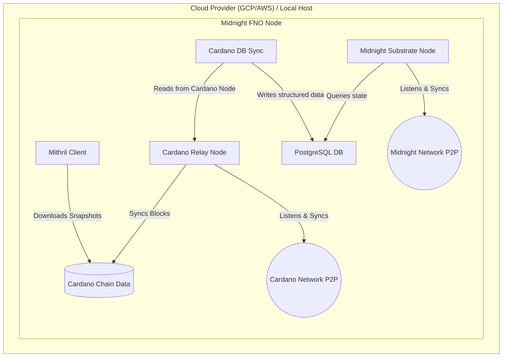

# Architecture Overview

## System Architecture

The Midnight node operates as a Partner Chain to Cardano. This means it has a strict dependency on synchronized Cardano chain state. 

### Components Detailed
1. **Mithril Client**: Downloads network snapshots to massively accelerate the syncing process of the Cardano Relay Node.
2. **Cardano Relay Node**: Connects to the Cardano P2P network to pull the latest blocks.
3. **Cardano DB Sync**: Reads blocks from the local Cardano Node and structures them into a PostgreSQL database.
4. **PostgreSQL Database**: Stores the structured chain state, ensuring reliable and persistent access for querying.
5. **Midnight Substrate Node**: Queries the structured data from PostgreSQL to validate partner-chain blocks and syncs with the Midnight P2P network.

### Design Philosophy

1. **Dependency Sequencing:** The Substrate node will fail to start correctly if the PostgreSQL database is unpopulated. Automation ensures DB Sync reaches maturity before starting Midnight.
2. **Data Availability:** Depending on the setup scripts used, nodes can be run in `--pruning archive` mode to support external indexers.
3. **Cloud-Native:** Automation relies heavily on idempotent tools like Ansible, heavily simplifying both Day 1 (Deployment) and Day 2 (Maintenance) operations.
